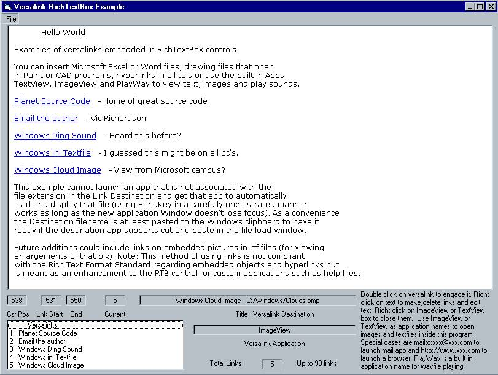



## Add Links in RichTextBox

### Description

Add links in your RichTextBox text that open images, text, sounds and any app associated with a filetype. (Not based on Rich Text Format standards for embedded objects).
 
### More Info
 

             |
---                |---
**Submitted On**   |2002-08-24 08:48:20
**By**             |[Vic Richardson](https://github.com/Planet-Source-Code/PSCIndex/blob/master/ByAuthor/vic-richardson.md)
**Level**          |Beginner
**User Rating**    |4.3 (26 globes from 6 users)
**Compatibility**  |VB 6\.0
**Category**       |[Complete Applications](https://github.com/Planet-Source-Code/PSCIndex/blob/master/ByCategory/complete-applications__1-27.md)
**World**          |[Visual Basic](https://github.com/Planet-Source-Code/PSCIndex/blob/master/ByWorld/visual-basic.md)
**Archive File**   |[Add\_Links\_1220758242002\.zip](https://github.com/Planet-Source-Code/vic-richardson-add-links-in-richtextbox__1-38249/archive/master.zip)

